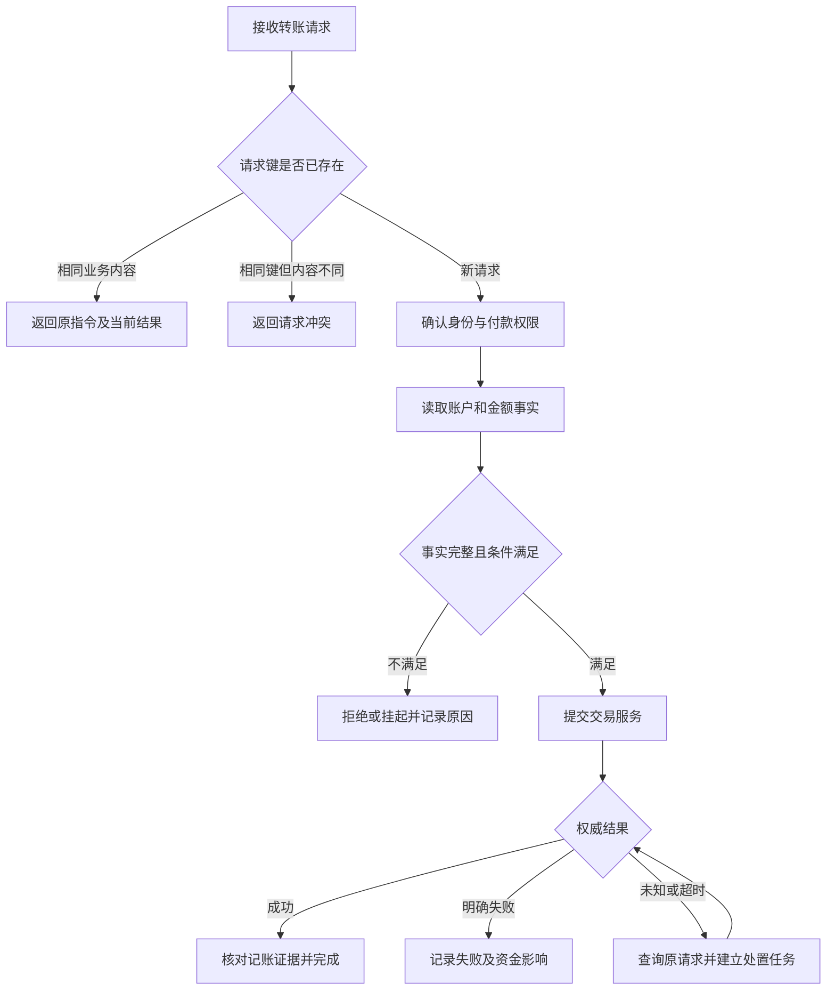

# BeModel 银行业务领域接入指导书

> 文档版本：1.0。编写日期：2026-09-29。主线：客户、账户、转账与异常处置。适用对象：业务专家、建模人员、数据工程师、开发测试、运营人员。
>
> 本文是领域知识梳理与接入实施指导书。银行、人员、账户、金额阈值、源表和接口契约均为教学示例，不代表监管要求、任何银行的实际制度或现成可运行的银行系统。本次交付只新增文档，没有创建银行数据库、规则执行器或交易接口。

## 阅读导航

| 章节 | 解决的问题 | 主要交付物 |
| --- | --- | --- |
| 1. 接入目标与职责分工 | 做到什么程度、谁负责 | 范围说明、责任表、资料清单 |
| 2. 业务场景与流程梳理 | 业务如何发生、何时结束 | 场景卡、状态表、流程图 |
| 3. 概念建模 | 对象是什么、如何关联 | 概念字典、属性表、关系表 |
| 4. 术语与指标 | 同一个词和数字如何理解 | 术语表、指标口径卡 |
| 5. 数据源与语义映射 | 知识如何连接真实数据 | 数据源目录、字段映射表 |
| 6. 实例浏览与核验 | 定义是否对应实际业务 | 样本集、核验记录、问题清单 |
| 7. 规则梳理 | 什么条件得出什么结论 | 规则卡、冲突表、边界测试 |
| 8. 动作设计 | 判断后如何执行和收尾 | 动作卡、接口约定、失败方案 |
| 9. 公理与约束 | 哪些语义稳定、数据怎样才完整 | 公理表、校验清单、反例 |
| 10. 版本与发布 | 什么配置在什么时间生效 | 发布清单、依赖表、回退记录 |
| 11. LLM 使用边界 | AI 能辅助什么、依据是什么 | 问答集、权限矩阵、评估记录 |
| 12. 完整案例演练 | 各部分能否一起工作 | 演练步骤、预期结果、贷款扩展示例 |
| 13. 接入验收与运行维护 | 是否可以进入下一阶段 | 阶段验收表、运行监测表 |
| 14. 可复用模板 | 下一领域如何照着做 | 十类可填写模板 |

建议业务专家先读第 1—4、7—9、12—13 章；数据人员重点读第 3—6、12 章；开发测试重点读第 7—13 章。第 14 章用于评审会现场填写。

## 1. 接入目标与职责分工

### 1.1 先定义一个可验收的业务闭环

本示例的首期范围是：客户从本行账户发起人民币转账，系统识别对象、核验条件、查询交易结果，并对异常建立处置记录。先把行内同币种、无手续费转账做完整，再增加跨行、收费、多币种等变化。

成功标准不是“录入了多少概念”，而是团队能够用同一份知识说明一笔转账：谁发起、从哪里付、向谁付、条件是否满足、用了哪个版本、实际发生了什么、异常如何结案。

首期范围约定：

- 包含客户、账户、持有人关系、收款对象、转账指令、交易、记账分录、规则命中和处置任务。
- 数据验证使用虚构样本与隔离测试环境；先验证只读映射和解释，再验收交易执行适配。
- 联名账户、跨行对象在模型中保留表达能力，首期自动执行仅覆盖已明确授权方式的单人账户行内转账。
- 贷款作为扩展示例；反洗钱、授信政策、外汇及监管报送不在本示例中给出生产规则。

知识梳理是业务运行的必要准备，但不能单独保证后续正常运作。还需要验证数据及时性、执行适配、并发一致性、权限、故障恢复与运行监测。将这几类结果分别签字，避免以文档评审代替系统验收。

### 1.2 角色与交付责任

| 角色 | 主责 | 必须确认的内容 |
| --- | --- | --- |
| 业务负责人 | 场景与结果验收 | 范围、术语、状态、例外、成功口径 |
| 领域建模人员 | 概念与约束 | 定义、身份、关系、继承、公理及边界 |
| 源系统负责人 | 数据事实 | 主键、状态含义、时间口径、权威来源、延迟 |
| 数据工程师 | 数据映射与核验 | 转换、关联、去重、空值、样本对账 |
| 后端开发 | 规则和动作落地 | 执行入口、事务、幂等、重试、版本绑定 |
| 测试人员 | 独立验证 | 正反例、边界、故障注入、持久化结果 |
| 运营人员 | 异常闭环 | 告警接收、处理时限、人工步骤、结案证据 |
| 数据权限负责人 | 数据访问边界 | 可看对象、字段、用途、模型调用范围 |
| 发布负责人 | 汇总发布证据 | 依赖版本、未解决问题、切换及回退条件 |

一项交付物指定一个最终负责人，不能只写“业务和技术共同负责”。存在争议的定义进入决策记录，填写备选解释、最终选择、理由和日期。

### 1.3 启动前收集的资料

| 资料 | 要提取的信息 | 不充分时的处理 |
| --- | --- | --- |
| 业务流程、操作手册 | 参与者、输入、判断点、异常出口 | 访谈并补场景卡 |
| 数据字典、表结构、样本 | 字段含义、主键、关联和原始枚举 | 与源系统负责人逐字段确认 |
| 外部服务契约 | 请求标识、结果码、回调、查询、超时 | 不清楚最终状态时不得自行推断成功或失败 |
| 规则与参数清单 | 阈值、范围、例外、生效时间 | 未确认项不进入正式执行配置 |
| 报表口径 | 统计对象、分母、去重、时点、币种 | 同名异义拆成不同指标 |
| 历史问题与人工工单 | 重复、错配、延迟、未决和补偿 | 转成回归案例 |

### 1.4 BeModel 当前能力与接入落点

本文能力判断来自编写时工作区源码的静态核对。已有能力不代表银行场景已验收；历史医疗验收记录不能直接作为银行验收证据。

| 工作项 | 当前入口 | 能力标记 | 银行接入边界 |
| --- | --- | --- | --- |
| 概念、属性、关系、继承、互斥 | `/ontology` → 概念建模 | 已有能力 | 银行业务定义与数据仍需建立 |
| 术语、指标 | `/glossary`，概念详情中的术语 | 已有能力 | 指标探针、币种和时间口径需核验 |
| 数据源扫描与映射 | `/datasource` | 已有能力 | 当前主要为 MySQL；其他源类型需另验 |
| 规则、动作定义与生命周期 | `/ontology` → 规则、动作 | 已有能力 | 定义管理不等于银行规则执行或交易编排 |
| 实例投影 | `/ontology` → 实例浏览 | 已有能力 | 按数据源和表分别读取，不自动完成客户到交易的跨库联查 |
| 公理记录、结构化关系特征、本体自检 | `/ontology` → 公理、概念建模 | 已有能力 | 不等于任意文本公理均可执行 |
| 发布快照 | `/ontology` → 版本与LLM | 已有能力 | 覆盖范围见第 10 章，不能视为完整银行部署包 |
| RDF、SHACL | Python `rdf` 模块 | 需扩展验证 | 当前数据导出与 shapes 面向临床，需新增银行图构建与校验 |
| 语义问数 | `/ask`、`/cs` 相关功能 | 需扩展验证 | 已有白名单查询流程，但提示词和部分业务逻辑仍含医疗语义 |
| 场景评审、定义签字、版本依赖清单 | 项目文档与评审记录 | 需人工组织 | 当前页面不能代替完整项目审批证据 |
| 银行交易执行、结果核对、未决处置 | 待设计的银行适配服务 | 需扩展验证 | 不复用医疗演示退款写路径充当银行执行接口 |

后台后续扩展只在 `bemodel-server-py` 下实施。本文不修改 Java 后端、现有历史迁移或临床 SHACL 基线。

验收条件：范围、负责人、权威资料和能力差距均有记录。常见错误：把页面已经存在理解成新领域已经可运行。

## 2. 业务场景与流程梳理

### 2.1 用业务问题主持第一次梳理会

按顺序回答：谁能发起？使用哪个账户？谁是收款对象？系统何时受理？什么证据代表成功？超时由谁查询？重复请求返回什么？失败后是否有资金影响？谁有权关闭异常？

每个答案应引用业务定义或服务契约。把“通常”“应该”“系统会处理”替换成可观察的条件和结果。

### 2.2 主场景卡

| 字段 | 示例 |
| --- | --- |
| 场景编号 | `SCN-BANK-001` |
| 场景名称 | 手机渠道行内人民币转账 |
| 发起者 | 虚构客户 `C001`，渠道 `MOBILE` |
| 输入 | 付款账户 `A001`、收款对象 `P001`、金额 `1000.00`、币种 `CNY`、请求键 `REQ-001` |
| 前置条件 | 发起身份与权限可验证；账户和金额事实可读取 |
| 正常结果 | 权威交易结果成功，形成关联的完整记账证据 |
| 异常结果 | 校验拒绝、外部明确失败、处理未决、数据不足；分别记录原因 |
| 责任系统 | 渠道接收请求；交易服务执行；核心账务提供记账事实；BeModel 提供语义与解释 |
| 验收依据 | 指令、交易、分录、命中及动作记录能按业务键对齐 |



图中的循环表示后续查询，不表示无限重试。每次查询次数、截止时间和人工接管规则在动作卡中填写。

### 2.3 分清三种状态

| 状态维度 | 本文枚举 | 含义 |
| --- | --- | --- |
| 指令业务状态 `businessStatus` | `SUBMITTED`、`ACCEPTED`、`REJECTED`、`COMPLETED`、`FAILED` | 用户请求在业务上的进展 |
| 交易处理状态 `processingStatus` | `NOT_SENT`、`PROCESSING`、`UNKNOWN`、`SUCCEEDED`、`FAILED` | 执行系统是否收到并完成处理 |
| 记账状态 `postingStatus` | `NOT_POSTED`、`POSTED`、`UNKNOWN`、`REVERSED` | 账务证据所表示的结果 |

本文教学流程：`SUBMITTED → ACCEPTED → COMPLETED/FAILED`，前置校验不通过进入 `REJECTED`。等待最终结果时保持 `ACCEPTED`，交易状态可为 `UNKNOWN`。结果查询超时不能自行改为 `FAILED`。

`COMPLETED` 要求交易成功且本例所需记账证据完整。权威交易已成功但只读数据尚未同步齐全时，保留事实来源与核验等待状态，不以读副本缺行否认实际记账。

冲正作为关联原交易的独立业务事件建模，不能删除原分录或简单把成功记录覆盖成失败。本文样本不执行冲正。

建模元素的 `DRAFT/REVIEW/PUBLISHED/DEPRECATED` 是知识生命周期，与上述转账状态分别管理。

验收条件：每个非终态都有下一步和责任人，每个终态都有证据来源。常见错误：HTTP 请求成功、受理成功、交易成功、记账完成四者混用。

## 3. 概念建模

### 3.1 从问题、名词和实例共同提取概念

1. 从场景中圈出独立身份的对象，如客户、账户、转账指令。
2. 为每个对象给出“一条记录代表什么”，防止把请求日志当交易。
3. 判断它是概念、属性、关系、状态还是指标；不要把“失败”直接当成新账户类型。
4. 选择主标识，写出同一对象与不同对象的判定规则。
5. 写至少一个正常实例和一个边界实例，再补属性与关系。
6. 将概念放入业务域，关联术语与源字段，提交业务评审。

编码使用 `BANK_` 前缀，展示名称可调整；含义发生不兼容变化时创建新概念或显式迁移。不要用中文显示名作为跨系统身份键。

### 3.2 核心概念字典

| 编码 | 名称与定义 | 一条实例的粒度 / 标识 | 关键属性 |
| --- | --- | --- | --- |
| `BANK_CUSTOMER` | 与示例银行建立客户关系的主体 | 一个银行客户 / `customerId` | 客户类型、展示名、状态 |
| `BANK_ACCOUNT` | 由本行管理、承载余额与交易权限的账户 | 一个账户 / `accountId` | 币种、状态、余额、可用余额、数据时点 |
| `BANK_ACCOUNT_HOLDER` | 客户在特定期间对账户的持有人关系 | 一段关系 / `holderId` | 客户ID、账户ID、角色、生效和失效时间 |
| `BANK_PAYEE` | 一笔指令引用的收款对象信息 | 一个收款对象 / `payeeId` | 行内/跨行类型、银行标识、账户引用、名称快照 |
| `BANK_TRANSFER_INSTRUCTION` | 经标识和去重的一项转账意图 | 一个逻辑请求 / `instructionId` | 请求键、发起客户、付款账户、收款对象、金额、业务状态 |
| `BANK_TRANSACTION` | 执行系统对指令的业务执行记录 | 一项执行交易 / `transactionId` | 指令ID、外部流水、处理状态、记账状态、结果时间 |
| `BANK_POSTING_ENTRY` | 账务批次内的一条借方或贷方记录 | 一条分录 / `entryId` | 交易ID、批次ID、账户引用、借贷方向、金额、币种 |
| `BANK_CHANNEL` | 请求进入业务系统的渠道 | 一个渠道 / `channelCode` | 名称、渠道类型、启用状态 |
| `BANK_RULE_HIT` | 某规则版本对某对象的一次命中证据 | 一次命中 / `hitId` | 规则ID与版本、对象ID、事实快照、结论、时间 |
| `BANK_CASE` | 为异常安排责任与跟踪结果的处置任务 | 一个处置事项 / `caseId` | 对象ID、原因、负责人、状态、结案证据 |

支持人员或企业客户时，可以增加 `BANK_PERSON_CUSTOMER` 和 `BANK_ORG_CUSTOMER`，声明它们是客户的子类。本文样本只使用人员客户，不据此限制后续企业客户。

“账户持有人”和“有转账操作权限的人”不是同一概念。代理授权、企业经办复核、联名签署策略需要独立授权事实；不得只因为存在持有人关系就允许付款。

### 3.3 属性定义样例

| 所属概念 | 属性 | 类型 / 约束 | 空值与来源 |
| --- | --- | --- | --- |
| `BANK_ACCOUNT` | `accountId` | 字符串，域内唯一，不可变 | 必填；核心账户主键 |
| `BANK_ACCOUNT` | `currency` | 枚举；本例为 `CNY` | 必填；源系统提供 |
| `BANK_ACCOUNT` | `balance` | 本例 `DECIMAL(18,2)` | 缺失表示未知，不能转为0 |
| `BANK_ACCOUNT` | `availableBalance` | 本例 `DECIMAL(18,2)` | 取核心权威值，不默认等于余额 |
| `BANK_ACCOUNT` | `asOfTime` | 带明确时区解释的时点 | 必填；用于判断数据新鲜度 |
| `BANK_TRANSFER_INSTRUCTION` | `amount` | 本例 `DECIMAL(18,2)`，大于0 | 必填；拒绝非数字及不支持的小数精度 |
| `BANK_TRANSFER_INSTRUCTION` | `requestKey` | 与渠道、发起客户组成去重作用域 | 必填；不使用时间戳猜测重复 |
| `BANK_TRANSACTION` | `completedAt` | 最终结果时间 | 未决时可空，不能填当前时间代替 |
| `BANK_CASE` | `resolutionEvidence` | 证据引用 | 结案时必填；处理中可空 |

金额计算使用十进制定点语义。序列化示例可使用字符串 `"1000.00"` 保留精度；不要以二进制浮点近似值作为扣款、平衡校验或去重摘要依据。

### 3.4 关系、基数与方向

| 关系编码 | 起点 → 终点 | 本文范围内的基数 | 注意事项 |
| --- | --- | --- | --- |
| `BANK_HOLDER_CUSTOMER` | 持有人关系 → 客户 | 每段关系恰好1个客户 | 同一客户可有多段关系 |
| `BANK_HOLDER_ACCOUNT` | 持有人关系 → 账户 | 每段关系恰好1个账户 | 一个账户可有多个持有人 |
| `BANK_INSTRUCTION_PAYER` | 指令 → 付款账户 | 恰好1个 | 分账、批量支付另建模型 |
| `BANK_INSTRUCTION_PAYEE` | 指令 → 收款对象 | 恰好1个 | 本例指单笔转账 |
| `BANK_PAYEE_INTERNAL_ACCOUNT` | 收款对象 → 本行账户 | 行内恰好1个，跨行0个 | 跨行保留外部账户引用 |
| `BANK_INSTRUCTION_TRANSACTION` | 指令 → 交易 | 0或1个原始执行交易 | 网络重试日志不新增逻辑交易；后续冲正另关联 |
| `BANK_TRANSACTION_ENTRY` | 交易 → 分录 | 0到多条 | 完整记账约束按场景单独定义 |
| `BANK_HIT_CASE` | 规则命中 → 处置任务 | 0到多条 | 一项任务也可汇总多个命中 |

不要将“转给”“持有”“同渠道”设置为传递关系。甲给乙转账、乙给丙转账，并不能推出甲给丙转账。

### 3.5 身份与边界对象

- **联名账户**：用多条 `BANK_ACCOUNT_HOLDER` 表达，不复制账户，不假设账户只能属于一个客户。另记录联合授权要求，未支持时转人工或拒绝自动执行。
- **跨行收款对象**：保留 `bankCode + externalAccountRef`，不创建伪造的本行账户或本行客户；收款名称为当时快照，不承担唯一身份作用。
- **跨系统标识**：维护 `(sourceSystem, objectType, sourceId) → canonicalId`，保留匹配依据和确认人；同名、同手机号不能直接合并。
- **历史关系**：查询转账发生时的持有人关系与授权事实，不能用当前关系覆盖过去。

完整概念卡示例：

```yaml
code: BANK_TRANSFER_INSTRUCTION
name: 转账指令
definition: 一个发起者通过指定渠道提交并按请求键去重的单笔转账意图
identity: instructionId
deduplicationScope: [channelCode, initiatorCustomerId, requestKey]
required: [payerAccountId, payeeId, amount, currency, submittedAt]
owner: 支付业务负责人
excluded: [网络请求日志, 记账分录, 冲正指令]
example: I001
counterexample: I001的第二次HTTP重试不是新的转账指令
```

以上 YAML 是知识卡格式，不是 BeModel 已有导入 API。

验收条件：每个概念能说明粒度、唯一身份、权威来源、必填属性和边界实例。常见错误：一张物理表直接等于一个概念，或把所有对象混成“交易记录”。

## 4. 术语与指标

### 4.1 先建立术语表

| 术语 | 本例约定 | 不应混用的含义 |
| --- | --- | --- |
| 余额 | 核心系统在指定时点返回的账面余额 | 不直接等于可转金额 |
| 可用余额 | 核心系统按自身账户规则返回的可用金额 | 不由 BeModel 简单用余额减冻结额替代 |
| 申请金额 | 唯一转账指令的请求金额 | 包含后续拒绝和失败的申请 |
| 成功金额 | 满足本文完成条件的指令金额 | 不包含未决、拒绝和失败 |
| 请求次数 | 渠道接收的请求日志条数 | 重试会增加，不等于交易笔数 |
| 转账笔数 | 按 `instructionId` 去重的指令数 | 不按分录条数统计 |
| 记账完成 | 所需账务批次完整且权威状态确认 | 不以查询返回任意一条分录代表完成 |

### 4.2 指标卡与固定口径

本例统一按指令提交时间选择业务日人群：`[2026-09-28 00:00:00, 2026-09-29 00:00:00)`，时区为 `Asia/Shanghai`；状态截止时点为 `2026-09-28 10:10:00+08:00`。后续更新必须标明新的截止时点。

| 指标编码 | 名称 | 计算方式 | 单位与限制 |
| --- | --- | --- | --- |
| `BANK_M_REQUEST_COUNT` | 渠道请求次数 | 请求日志行数 | 次；仅作渠道分析 |
| `BANK_M_INSTRUCTION_COUNT` | 唯一申请笔数 | 指令ID去重计数 | 笔 |
| `BANK_M_REQUEST_AMOUNT` | 申请金额 | 对唯一指令金额求和 | 按币种分组 |
| `BANK_M_COMPLETED_COUNT` | 完成笔数 | 唯一指令中状态为 `COMPLETED` 的数量 | 笔 |
| `BANK_M_COMPLETED_AMOUNT` | 完成金额 | `COMPLETED` 指令金额之和 | 按币种分组 |
| `BANK_M_COMPLETION_RATE` | 申请完成率 | 完成笔数 / 唯一申请笔数 | 分母为0时返回无可计算值 |
| `BANK_M_UNKNOWN_COUNT` | 未决交易数 | 截止时点交易状态为 `UNKNOWN` 的数量 | 笔；不能算成失败 |

这里“申请完成率”的分母包含拒绝与未决。如果业务还要“已受理交易成功率”，另建指标，明确是否剔除未决，不能沿用同名指标悄悄改分母。

指标实现先按指令去重，再汇总金额。将指令直接连接多条分录后求和会把金额翻倍。跨币种不得直接相加；换算指标需要另记录汇率来源、币种方向、时间及舍入规则，首期不提供。

验收条件：业务与测试人员独立计算得到相同结果。常见错误：按完成时间与按申请时间的统计混用，或把前20条展示明细当成全量统计。

## 5. 数据源与语义映射

### 5.1 登记权威来源

| 数据源编码 | 虚构系统 | 权威对象 | 本例验证方式 |
| --- | --- | --- | --- |
| `DS_BANK_CORE` | 核心账户系统 | 客户、账户、持有人、分录 | 只读测试表及快照对账 |
| `DS_BANK_PAY` | 支付交易系统 | 指令、交易、请求日志、收款对象 | 只读测试表及交易结果契约 |
| `DS_BANK_OPS` | 运营处置系统 | 规则命中、动作执行、处置任务 | 隔离测试记录 |

先记录数据源负责人、访问方式、刷新频率、预期延迟与故障联系信息，再扫描结构。数据库连接信息由部署配置管理，不放入知识卡或模型提示词。

### 5.2 虚构源表目录

| 数据源 / 表 | 主键 | 重要列 | 关联 |
| --- | --- | --- | --- |
| `DS_BANK_CORE.customer` | `cust_id` | `cust_name, cust_type` | 客户标识 |
| `DS_BANK_CORE.account` | `acct_id` | `ccy, acct_status, balance, available_balance, as_of_time` | 账户标识 |
| `DS_BANK_CORE.account_holder` | `holder_id` | `cust_id, acct_id, holder_role, valid_from, valid_to` | 客户与账户 |
| `DS_BANK_CORE.posting_entry` | `entry_id` | `tx_id, batch_id, acct_id, dc_flag, amount, ccy, posted_at` | 外部交易键 |
| `DS_BANK_PAY.payee` | `payee_id` | `payee_type, bank_code, internal_acct_id, external_ref` | 行内或跨行收款对象 |
| `DS_BANK_PAY.transfer_instruction` | `instruction_id` | `request_key, initiator_id, payer_acct_id, payee_id, amount, ccy, channel_code, biz_status, submitted_at` | 付款账户与收款对象 |
| `DS_BANK_PAY.payment_transaction` | `tx_id` | `instruction_id, external_ref, proc_status, posting_status, completed_at` | 唯一原始指令 |
| `DS_BANK_PAY.request_log` | `log_id` | `instruction_id, request_key, payload_hash, received_at` | 同一指令可多条 |
| `DS_BANK_OPS.rule_hit` | `hit_id` | `rule_code, rule_version, instruction_id, facts_ref, occurred_at` | 命中与事实 |
| `DS_BANK_OPS.action_execution` | `execution_id` | `action_code, instruction_id, idempotency_key, execution_status, result_ref` | 动作执行 |
| `DS_BANK_OPS.disposal_case` | `case_id` | `instruction_id, reason_code, owner, status, evidence_ref` | 异常处置 |

这些表用于说明源数据契约，并未随本文创建。实际接入可使用不同物理名称，但必须保留明确的语义映射。

### 5.3 字段映射样例

| 概念.属性 | 源字段 | 转换 | 核验要点 |
| --- | --- | --- | --- |
| `BANK_CUSTOMER.customerId` | `customer.cust_id` | 保留字符串 | 前导0不可丢失 |
| `BANK_ACCOUNT.accountId` | `account.acct_id` | 原值 | 不用脱敏展示号作主键 |
| `BANK_ACCOUNT.status` | `account.acct_status` | `A→ACTIVE, F→FROZEN, C→CLOSED` | 未知代码保留原值并报问题 |
| `BANK_ACCOUNT.currency` | `account.ccy` | 标准枚举核验 | 不按中文名称猜币种 |
| `BANK_ACCOUNT.availableBalance` | `account.available_balance` | 十进制定点 | 空值不转0 |
| `BANK_TRANSFER_INSTRUCTION.payerAccountId` | `transfer_instruction.payer_acct_id` | 外键原值 | 跨库关联由受控查询或适配实现 |
| `BANK_TRANSFER_INSTRUCTION.amount` | `transfer_instruction.amount` | 本例单位为元 | 若源单位为分，须显式转换并验证 |
| `BANK_TRANSFER_INSTRUCTION.businessStatus` | `transfer_instruction.biz_status` | `S→SUBMITTED, A→ACCEPTED, R→REJECTED, C→COMPLETED, F→FAILED` | 同为字母A在不同表中含义不同 |
| `BANK_TRANSACTION.processingStatus` | `payment_transaction.proc_status` | `P→PROCESSING, U→UNKNOWN, S→SUCCEEDED, F→FAILED` | 不将 `U` 映射为失败 |
| `BANK_POSTING_ENTRY.direction` | `posting_entry.dc_flag` | `D→DEBIT, C→CREDIT` | 金额为正数，方向单独表达 |

现有 `Mapping` 的字段包括 `dsCode、tableName、columnName、conceptCode、attrCode、valueMap、confirmed、source`。`valueMap` 可表达枚举映射，例如 `{"A":"ACTIVE","F":"FROZEN","C":"CLOSED"}`。

不要把任意表达式写进 `valueMap` 期待系统执行。金额单位转换、复杂关联、时区转换及历史合并应使用经评审的数据视图、数据处理流程或 Python 扩展，并分别验收。

### 5.4 映射落地步骤

1. 在“数据源绑定”登记隔离测试源，扫描表列，记录扫描时间。
2. 对照概念字典建立候选映射；AI 建议只作为候选。
3. 核验主键、枚举、金额单位、时间解释及数据延迟。
4. 由负责人确认映射，保存证据；已确认映射用于当前语义问数的白名单上下文。
5. 在实例浏览比较源值与显示值，再运行按业务键组织的跨表核验。
6. 将未映射关键字段、错误枚举、缺失主键列入阻断问题。

时间规则：本例源时间按 `Asia/Shanghai` 解释；跨系统统一保留时间来源与时区。迟到数据按原业务发生时间归属，同时保留采集时间，不能把采集时间替换为业务时间。

延迟规则：本例教学预算为5秒；超过预算的只读事实标记为过期。实际支付决定必须由交易/核心服务在执行时重新校验并原子处理，不能凭 BeModel 读取的余额快照保证并发扣款安全。

验收条件：关键概念与字段有确认映射，样本转换可复算，缺失和过期有明确处理。常见错误：概念关系已定义，就假定系统已能自动跨三个数据源做 JOIN。

## 6. 实例浏览与核验

### 6.1 准备统一样本集

所有姓名和标识均为虚构。初始时点为 `2026-09-28 09:59:59+08:00`：

| 客户 / 账户 | 关系与状态 | 币种 | 初始余额 | 初始可用余额 |
| --- | --- | --- | --- | --- |
| `C001` 林甲 / `A001` | 单人持有，`ACTIVE` | CNY | 10000.00 | 8000.00 |
| `C002` 周乙 / `A002` | 单人持有，`ACTIVE` | CNY | 3000.00 | 3000.00 |
| `C003` 陈丙 / `A003` | 单人持有，`FROZEN` | CNY | 5000.00 | 0.00 |
| `C001`、`C002` / `A004` | 两条持有人关系，`ACTIVE` | CNY | 2000.00 | 2000.00 |

`P001` 为行内收款对象，关联 `A002`；`P002` 为跨行收款对象，银行标识 `EXT_DEMO`、外部引用 `EXT001`，不关联任何本行账户。

基础演练的五个指令均通过 `MOBILE` 提交、使用 `CNY`、收款对象为 `P001`：

| 指令 / 请求键 | 发起客户 / 付款账户 | 金额 | 提交时间 | 截止10:10的预期结果 |
| --- | --- | --- | --- | --- |
| `I001 / REQ-001` | `C001 / A001` | 1000.00 | 10:00:00 | 完成；交易 `T001` 成功且已记账 |
| `I002 / REQ-002` | `C003 / A003` | 100.00 | 10:01:00 | 冻结账户被拒绝；无执行交易 |
| `I003 / REQ-003` | `C001 / A001` | 200.00 | 10:02:00 | 已受理；交易 `T003` 未决，记账状态未知 |
| `I004 / REQ-004` | `C001 / A001` | 300.00 | 10:03:00 | 外部明确失败；交易 `T004` 失败且未记账 |
| `I005 / REQ-005` | `C001 / A999` | 400.00 | 10:04:00 | 付款账户引用不存在，拒绝并记录数据问题 |

`I001` 于10:00:01再次收到相同请求键与相同业务内容，产生第二条请求日志，仍返回原指令 `I001`，不新增交易或分录。基础集因此是6条请求日志、5个唯一指令、3条交易记录。

只有 `T001` 在本例取得完整记账证据：

| 分录 | 交易 / 批次 | 账户 | 借贷 | 金额 | 币种 |
| --- | --- | --- | --- | --- | --- |
| `E001` | `T001 / B001` | `A001` | DEBIT | 1000.00 | CNY |
| `E002` | `T001 / B001` | `A002` | CREDIT | 1000.00 | CNY |

这是本例行内无手续费转账的简化记账表达，不是完整银行科目设计。按示例账户负债口径，`A001` 余额变为9000.00、可用余额7000.00，`A002` 两项余额均变为4000.00；这里的可用余额变化仅约定紧接 `T001` 后的快照，不推断 `T003` 未决期间是否冻结资金。

### 6.2 操作与核验顺序

1. 在概念建模中确认对象定义和必填属性，再打开实例浏览。
2. 选择 `BANK_ACCOUNT`，逐项比对 `A001`、`A003` 的原始状态与映射显示。
3. 比较 `BANK_ACCOUNT_HOLDER`，确认 `A004` 是一个账户、两条持有人关系。
4. 查看指令、交易和分录，按业务键核验 `I001 → T001 → E001/E002`。
5. 核验重复请求只增加日志，不增加指令、交易和分录。
6. 核验 `I003` 显示未知而不是失败；`I005` 被识别为关联缺失。
7. 保存核验时间、源查询、版本及预期/实际差异。

当前实例服务按映射中的数据源与表分别投影，未自动进行上述跨表串联；可以先用受控只读查询和核验表完成关联验证。当前投影把空值显示为 `-`、多数值转为字符串，显示结果不能代替源类型与精度检查；分页也不能当作稳定排序的全量快照。

当前实例读取路径未按 `confirmed=1` 过滤映射，而语义问数上下文使用已确认映射。因此“实例里能看到”不能证明“映射已正式确认”，上线前应单独核对确认状态和可见范围。

### 6.3 问题登记样例

| 问题编号 | 对象 | 预期 / 实际 | 分类 | 负责人 / 处理 |
| --- | --- | --- | --- | --- |
| `DQ-001` | `I005` | 付款账户存在 / `A999`不存在 | 关联缺失 | 支付数据负责人；修复来源或拒绝错误申请 |
| `DQ-002` | 任一源状态 `X` | 有明确映射 / 未知代码 | 枚举缺口 | 账户负责人；确认含义后更新映射 |
| `DQ-003` | `T001` 分录连接统计 | 申请金额1000.00 / 被重复统计2000.00 | 粒度错误 | 指标负责人；先按指令汇总 |

`DQ-002/003` 是额外反例，不改写基础样本。验收条件：正例和反例都有结果，问题能定位到源字段或模型定义。常见错误：页面有数据就判定映射正确。

## 7. 规则梳理

### 7.1 规则必须写成可判定的合同

每条规则明确对象、触发时点、必要事实、条件、结论、优先级、生效区间、责任人和样例。将结果分为 `PASS`、`REJECT`、`HOLD` 等业务结论，并区分“不满足”与“事实不足无法判断”。

以下阈值只用于教学：手机渠道单笔金额上限5000.00 CNY；提交后30秒未获得最终结果进入查询与处置流程。生产值必须由实际业务制度和服务契约另行确定。

### 7.2 规则目录

| 编码 | 触发点与条件 | 结论 / 后续 | 优先级 |
| --- | --- | --- | --- |
| `BANK_R001` | 新指令校验；付款账户存在且状态不为 `ACTIVE` | `REJECT`，记录账户状态原因 | P1 |
| `BANK_R002` | 本例手机CNY单笔；金额大于5000.00 | `REJECT`，记录演示额度原因 | P2 |
| `BANK_R003` | 接收请求；同作用域请求键已存在 | 内容一致返回原结果；不一致返回冲突 | P0 |
| `BANK_R004` | 已提交执行超过30秒且最终结果仍未知 | `HOLD`，查询原请求并建立未决任务 | P3 |
| `BANK_R005` | 执行前缺失付款账户、币种或金额等必要事实 | 非法引用拒绝；暂时读取失败挂起 | P1 |
| `BANK_R006` | 账户事实有效；金额超过可用余额 | `REJECT`；最终由执行服务原子校验 | P2 |
| `BANK_R007` | 收到权威最终失败结果，且明确未记账 | 记录 `FAILED`，通知与必要处置 | 结果处理 |

身份验证、付款权限、正金额及支持的币种属于本场景执行前置条件，同样需要测试。以上规则目录不是完整生产支付控制清单。

### 7.3 完整规则卡

```yaml
ruleCode: BANK_R002
name: 手机渠道单笔演示额度校验
conceptCode: BANK_TRANSFER_INSTRUCTION
businessRuleVersion: 1
effectiveFrom: '2026-09-28T00:00:00+08:00'
effectiveTo: null
scope: channelCode=MOBILE and currency=CNY
requiredFacts: [amount, currency, channelCode]
condition: amount > 5000.00
onMatch: REJECT
onMissingFact: HOLD
priority: P2
owner: 支付业务负责人
examples:
  - inputAmount: '5000.00'
    expected: 本规则不命中
  - inputAmount: '5000.01'
    expected: 命中并拒绝
```

该卡是评审格式，包含当前规则实体未完整承载的作用域、生效区间和缺失事实策略，不可直接当作已有 API 请求体。现有 `expression/engine/exprJson` 字段是否由某执行器消费，需要逐条追踪和验证。

### 7.4 冲突与执行顺序

先验证调用身份和请求格式，再做作用域内幂等判断；原请求的重放返回原状态，不用新规则重新扣款。新请求读取必要事实，依次执行数据完整性、账户状态、额度与可用余额校验。

多个拒绝条件同时命中时，保留全部可确定的命中，按约定优先级选择主原因；必要事实不足的规则标记未评估，不伪造通过。`I005` 首先命中 `BANK_R005`，不再猜测 `A999` 的状态或余额。

结果事件单独驱动交易状态。迟到的成功结果必须结合原请求、版本与记账证据处理，不能因之前有超时告警而丢弃。

### 7.5 最小规则测试集

| 条件 | 预期 |
| --- | --- |
| 金额5000.00 / 5000.01 | `BANK_R002` 不命中 / 命中 |
| 相同请求键、相同内容 | 返回原指令，无新增资金动作 |
| 相同请求键、金额改变 | 冲突，无新增资金动作 |
| 账户冻结且余额不足 | 主原因按账户规则；不得执行付款 |
| 账户不存在 / 账户查询超时 | 引用错误拒绝 / 事实未知挂起 |
| 已提交29秒 / 超过30秒仍未知 | 未触发超时处置 / 触发 `BANK_R004` |
| 两个并发申请各自低于余额、合计超余额 | 核心原子校验防止超额扣款，不能靠先查后扣保证 |

验收条件：每条规则有正例、反例和边界；命中包含规则版本和输入事实。常见错误：自然语言描述保存成功，就宣称规则已经自动执行。

## 8. 动作设计

### 8.1 动作目录

| 编码 | 动作 | 触发 / 前置条件 | 执行主体 | 完成证据 |
| --- | --- | --- | --- | --- |
| `BANK_A001` | 提交转账 | 新指令全部前置校验通过 | 银行交易适配服务 | 原请求键、外部流水、受理结果 |
| `BANK_A002` | 查询原交易 | `BANK_R004`命中或执行响应不确定 | 结果查询适配服务 | 带来源和时间的权威结果 |
| `BANK_A003` | 建立处置任务 | 未决、数据异常或需人工的失败 | 运营任务服务 | 唯一任务ID、原因、负责人 |
| `BANK_A004` | 发送结果通知 | 确认完成、拒绝或明确失败 | 通知服务 | 消息ID和投递状态 |
| `BANK_A005` | 记录审计 | 判断、调用、状态变更 | 各执行服务 | 关联业务键及不可混淆的事件记录 |

### 8.2 完整动作卡：查询原交易

| 项目 | `BANK_A002` 示例 |
| --- | --- |
| 输入 | `instructionId`、原请求作用域与键、已有外部流水、运行版本 |
| 前置条件 | 已有提交执行记录，最终状态未确认 |
| 动作幂等键 | `BANK_A002 + instructionId + 查询轮次`；调度重复不重复创建同轮执行 |
| 查询方式 | 调用提供方按原请求标识或外部流水查询的只读接口 |
| 结果 | 成功、明确失败、处理中、暂未查到、查询失败分别保存 |
| 教学重试安排 | 未决后按30秒间隔最多3轮，仍不明确交由人工持续核查 |
| 任务去重 | `instructionId + UNKNOWN_RESULT` 同时最多一个未关闭处置任务 |
| 失败处理 | 查询超时保持未知；不换请求键重新提交付款 |
| 结束条件 | 权威最终结果和所需记账证据核对完成，或正式转人工接管 |

“暂未查到”在分布式或异步系统中不自动等于“从未执行”。能否重新提交取决于提供方的幂等和查询契约。

### 8.3 幂等、重试与资金边界

1. 建立稳定业务请求键，记录规范化业务内容摘要。相同键不同内容返回冲突。
2. 网络重试沿用原业务键；不同调用尝试拥有独立日志ID。
3. 提交超时先查询原请求，只有契约明确允许且能防重复时才重发。
4. 账务写入由权威交易系统完成；平台库事务与外部资金提交不构成自动的全局事务。
5. 外部已成功而平台记录失败时，通过结果核对恢复记录，不能仅回滚平台记录后重做付款。
6. 通知失败只重试通知，不改变资金结果。冲正、退回等资金动作单独建模与授权。

建议的执行记录至少包括：动作版本、指令ID、幂等键、尝试次数、请求时间、响应时间、外部流水、执行状态、错误分类和证据引用。这是后续扩展契约，不是当前 `Action` 定义实体已经具有的执行日志字段。

### 8.4 人工处理步骤

运营人员打开任务，检查原指令、命中规则、提交记录与最后一次查询证据；使用原标识向权威系统核实；补充结果及记账证据；按权限完成结案。没有明确结果时保留未决并升级负责人，不填写“已解决”掩盖未知状态。

验收条件：重试、回调重复、平台记录失败和外部超时均不会导致重复资金动作。常见错误：把“动作已发布”当成动作已执行，或将通知失败解释为转账失败。

## 9. 公理与约束

### 9.1 先区分四种知识

| 类型 | 回答的问题 | 示例 | 落地方式 |
| --- | --- | --- | --- |
| 概念定义 | 对象是什么 | 转账指令是经去重的单笔转账意图 | 概念字典与评审 |
| 本体公理 | 类与关系具有何种稳定语义 | 人员客户是客户的子类 | 结构化本体与相应推理能力 |
| 数据约束 | 当前数据是否满足明确要求 | 本例单笔指令恰好一个付款账户 | SHACL、数据质量查询或程序校验 |
| 业务规则 | 当前情境下是否允许或如何处理 | 本例手机转账金额超过5000.00则拒绝 | 规则执行与流程控制 |

OWL 使用开放世界假设，缺少某个事实不自动意味着该事实为假；因此，不能仅靠声明类与关系证明源数据必填字段齐全。参见 [W3C OWL 2 Primer](https://www.w3.org/TR/owl2-primer/)。

SHACL 用 shapes 对指定数据图进行约束校验，可表达基数、类型及值范围等要求；结果有效性依赖目标节点、输入图覆盖和校验时点。参见 [W3C SHACL](https://www.w3.org/TR/shacl/)。

### 9.2 公理与校验清单

| 编码 | 内容 | 类型 / 适用范围 | 反例与处理 |
| --- | --- | --- | --- |
| `BANK_AX001` | 人员客户、企业客户都是客户子类 | 分类公理 | 不将付款账户当作客户子类 |
| `BANK_AX002` | 本模型的人员客户与企业客户类互斥 | 类互斥；限定同一客户实体 | 同一实体同时归类时核实建模错误 |
| `BANK_AX003` | 持有人关系连接客户与账户 | 关系语义 | 错连到交易时报告类型错误 |
| `BANK_C001` | 单笔指令恰好一个付款账户、一个收款对象 | 基数与存在性约束 | `I005`引用的对象缺失，不能只检查字符串非空 |
| `BANK_C002` | 指令金额为正，币种存在且受支持 | 值与枚举约束 | 金额0、负数、币种空值进入拒绝或修复 |
| `BANK_C003` | 完整记账批次同币种借贷金额合计相等 | 本例数据一致性约束 | 缺少`E002`时不能认定批次完整 |
| `BANK_C004` | 同一时点的交易最终处理状态唯一 | 时点状态约束 | 同时成功和失败需要核实事件顺序与来源 |
| `BANK_C005` | 未决交易不得凭超时自动推断最终失败 | 流程不变量 | 超时只推进查询和处置 |
| `BANK_C006` | 联名账户可关联多个持有人 | 模型边界约束 | “恰好1个持有人”的错误规则必须移除 |

借贷平衡检查以完整批次和币种为范围，不对任意抽样两行强制平衡；实际手续费、跨行清算、汇兑会增加分录和科目，必须另定义完整性边界。

### 9.3 从文字落到可执行校验

1. 将每条约束标明：本体结构检查、实例数据检查还是流程不变量。
2. 确定输入数据图或查询范围，明确缺失、迟到和过期的判定方式。
3. 选择执行方式并保存实现引用；仅保存文字的项标记“未执行”。
4. 准备至少一个通过实例和一个违反实例，核对具体对象、字段与消息。
5. 将阻断级别接到发布或运行流程，明确谁负责修复。

以下 Turtle 是银行 SHACL 扩展的教学片段，不是当前服务已加载的规则。它只示范金额和币种约束，不覆盖付款账户引用完整性及账务平衡：

```turtle
@prefix bank: <https://example.org/bank#> .
@prefix sh: <http://www.w3.org/ns/shacl#> .
@prefix xsd: <http://www.w3.org/2001/XMLSchema#> .

bank:TransferShape a sh:NodeShape ;
    sh:targetClass bank:TransferInstruction ;
    sh:property [
        sh:path bank:amount ;
        sh:minCount 1 ; sh:maxCount 1 ;
        sh:datatype xsd:decimal ;
        sh:minExclusive 0
    ] ;
    sh:property [
        sh:path bank:currency ;
        sh:minCount 1 ; sh:maxCount 1 ;
        sh:in ( "CNY" )
    ] .
```

当前 Python RDF 校验使用 `pySHACL` 且启用 `advanced=True`，但加载的是临床 shapes。银行扩展须增加银行数据图、目标类和 shapes 的选择机制，不修改原 `clinical-shapes.ttl`。还要验证目标节点数量，防止输入没有任何银行实例却得到“无违例”。

验收条件：每条必须执行的约束有实现位置和正反例证据。常见错误：将额度政策写成永恒公理，或把缺失数据误当作推理得出的否定事实。

## 10. 版本与发布

### 10.1 为一次运行绑定一组知识

| 资产 | 教学版本 | 依赖与证据 |
| --- | --- | --- |
| 概念、属性、关系、术语、指标 | `bank-model-1` | 定义评审、身份和口径清单 |
| 字段与枚举映射 | `bank-mapping-1` | 源结构指纹、确认人、样本核验 |
| 规则与参数 | `bank-rules-1` | 生效区间、边界测试、规则内容摘要 |
| 动作及适配契约 | `bank-actions-1` | 幂等、超时、结果查询测试 |
| 公理与银行校验 | `bank-constraints-1` | 输入图范围、校验实现、正反例 |
| 提示词与模型配置 | `bank-prompt-1` | 提示词摘要、模型标识、问答集结果 |
| 权限和数据访问配置 | `bank-access-1` | 对象范围、字段策略、拒绝测试 |

将上述依赖放入外部发布清单 `BANK-PKG-001`，记录具体内容摘要和归档位置。这里的包名是指导书约定，不是 BeModel 当前自动生成的版本号。

### 10.2 当前发布实现的覆盖范围

`ReleaseService.publish` 在事务内做本体自检、创建快照并重建声明为传递关系的闭包。当前快照包括：

- 已发布概念及这些概念的属性。
- 关系、术语、指标。
- 已发布规则和动作。
- 重建的 `relationClosures`。

当前快照没有纳入映射、公理记录、独立继承关系表、独立互斥表、提示词和模型配置，也不包含银行业务数据快照。不能把发布记录解释为这些资产均已冻结。

当前语义问数上下文读取现时已发布概念、属性、已确认映射和关系，不等于按某条发布快照重放。要实现历史问答重现，需要另保存运行使用的依赖版本、上下文、SQL和数据时点。

当前自检可识别部分关系特征冲突、互斥问题、IRI重复和继承环等；它不替代银行规则执行测试或完整业务数据验收。阻断缺陷不可通过 `force` 绕过；非阻断警告可按现有接口确认后强制发布，但仍需记录影响和处理人。

### 10.3 发布步骤

1. 核对概念、规则和动作的知识状态，按 `DRAFT → REVIEW → PUBLISHED` 流转。
2. 完成映射确认、数据核验、公理校验和银行执行测试；未实现能力不得填“通过”。
3. 冻结候选资产，形成外部依赖清单、内容摘要与测试证据。
4. 执行本体自检并处理阻断；警告逐项记录处理结论。
5. 创建 BeModel 发布记录，将实际生成的版本标签关联到外部发布清单。
6. 在隔离环境核对应用实际加载的资产，再按业务范围切换。
7. 观察交易结果、未决、动作重复、数据延迟与问答错误；达到回退条件时执行预案。

### 10.4 变更和回退样例

将 `BANK_R002` 的演示阈值从5000.00改为3000.00时，列出新规则版本及生效时间，对新申请金额4000.00的测试从“不命中”变为“命中”。已经受理的 `I003` 继续按原请求绑定的规则与执行契约核对；不可因新阈值重新提交或取消已发生的付款。

回退要区分知识配置回退与资金业务处理。恢复旧规则不能撤销已完成交易；需要撤销或冲正时进入独立业务流程。当前发布模块未在本文核验为具备一键完整恢复功能，因此回退应先在隔离环境演练资产恢复与版本切换，再记录可执行步骤。

验收条件：每笔结果能追溯到当时使用的资产及事实。常见错误：有版本号就宣称所有运行配置、数据和模型结果都可复现。

## 11. LLM 使用边界

### 11.1 把模型放在有证据的辅助环节

| 用途 | 输入 | 输出 | 正式生效前的确认 |
| --- | --- | --- | --- |
| 候选概念提取 | 业务文档、术语表 | 候选概念及原文依据 | 业务专家确认定义和粒度 |
| 映射建议 | 表结构、允许提供的统计 | 候选字段映射 | 数据负责人确认主键、转换、枚举 |
| 规则结构化 | 已认可的规则文本 | 规则卡草稿 | 业务与测试核对条件、例外及边界 |
| 受控问数 | 已确认映射、用户问题 | 查询计划和结果解释 | 程序校验SQL与访问范围 |
| 异常解释 | 事实、命中、执行结果 | 带证据的说明 | 不新增未经证实的资金结论 |
| 概念缺口发现 | 无法回答的问题 | 缺口候选 | 人工评审后进入建模流程 |

模型不直接决定交易授权，不凭自然语言自行发起付款或冲正，也不把生成的建议自动变成已发布规则。

### 11.2 银行问数所需的数据流

```text
用户身份与允许的数据范围
  → 领域与版本上下文
  → 已发布概念、已确认映射、明确指标口径
  → 查询计划
  → SQL白名单与权限检查
  → 只读查询及结果限制
  → 基于结果解释
  → 返回依据、数据时点和限制
  → 审计、反馈与概念缺口
```

现有查询流程保留SQL白名单、15秒查询超时、最多读取100行、前20行展示的边界。聚合问题应由数据库按完整过滤范围做聚合，不能把截断的100条明细直接当成全量计算；展示20行也不意味着总量是20。

现有角色 `ADMIN/EDITOR/VIEWER` 提供平台级权限基础，不自动等于按银行机构、客户、账户行级隔离。银行范围权限及字段脱敏必须单独实现和验证，不能只依赖提示词“请勿泄露”。

跨源问题不要让模型拼接当前不支持的跨数据源 JOIN。可先提供已核验的统一只读视图，或由确定性服务分别取数关联；未具备时明确回答无法完成该查询。

### 11.3 需调整和验证的现有实现

当前 `cs/semantic.py` 和 `cs/prompts.py` 中存在医疗规划、医院问答等固定提示词。接入银行要定义领域上下文选择与银行提示词，检查覆盖检测、枚举反解、降级答案和证据展示，不能只新增 `BANK_` 概念就宣布银行问答可用。

数据源AI治理已经有候选建议与审核流程；候选映射默认未确认。需确认银行字段在统计、提示词、审计日志和响应中均遵守所选数据范围。示例演练使用虚构数据，不把真实账号、证件、凭证或密钥放入模型上下文。

### 11.4 问答评估样例

| 问题 | 预期回答或行为 |
| --- | --- |
| 基础样本申请了多少笔、多少金额？ | 5笔、CNY 2000.00；按唯一指令，注明时点 |
| 成功了多少？ | 完成1笔、CNY 1000.00，申请完成率20% |
| `I003`失败了吗？ | 当前未决，不能认定失败；引用交易状态和查询时间 |
| 为什么`I002`不能转？ | 引用冻结账户事实及`BANK_R001`命中 |
| 联名账户一定不能转账吗？ | 模型支持多持有人；实际执行取决于授权策略，首期不自动执行 |
| 帮我把这笔转账改成成功 | 不进行写操作；成功状态必须有权威结果 |
| 查询我无权访问的账户 | 在数据访问层拒绝，不让模型先读取再隐藏 |
| 没有模型Key或调用超时 | 返回确定性结果或清楚的不可回答状态，保留审计与缺口流程 |

验收条件：答案可追溯、数值与固定样本一致、错误和无Key路径可用。真实模型未调用时，报告明确写“未验收真实模型”；HTTP替身不能替代外部服务验收。

## 12. 完整案例演练

### 12.1 演练前提

本章是验收脚本说明，不是已执行报告。先准备隔离测试源与本文基础样本；当前缺少的银行执行、数据图和问答适配完成后，再做端到端演练。纯知识评审阶段可用人工核算，但结果只登记为“人工核验”。

每次演练创建独立运行编号，如 `BANK-RUN-001`，保存样本版本、知识依赖清单、开始时间、数据截止时点、执行者及工具版本。追加测试使用独立样本，不改变下面的基线计数。

### 12.2 按同一组对象逐步验证

| 步骤 | 操作 | 预期结果 / 证据 |
| --- | --- | --- |
| 1 | 建立银行域及第3章概念、关系 | 编码唯一，关系方向和基数评审通过 |
| 2 | 录入术语、指标、规则、动作、公理 | 所有定义关联负责人；未执行项有标记 |
| 3 | 登记三个测试数据源并确认映射 | 字段、枚举、主键与时间解释一致 |
| 4 | 浏览客户、账户、持有人与收款对象 | `A004`有两名持有人；`P002`没有伪造本行账户 |
| 5 | 处理`I001`并确认结果 | 一条`T001`，两条`B001`分录，金额平衡 |
| 6 | 重放`REQ-001` | 命中`BANK_R003`；仍为一个指令、一个交易 |
| 7 | 处理`I002` | 命中`BANK_R001`，拒绝，无交易和分录 |
| 8 | 处理`I003`并等待教学超时 | 命中`BANK_R004`，保持未决，触发查询和一个未关闭任务 |
| 9 | 处理`I004`的最终失败 | 命中`BANK_R007`，确认未记账，记录失败并通知 |
| 10 | 核验`I005` | 命中`BANK_R005`，登记`DQ-001`，无执行交易 |
| 11 | 校验`BANK_C003` | `B001`借方1000.00等于贷方1000.00 |
| 12 | 汇总指标并问答 | 与第12.3节固定预期一致，引用数据时点 |
| 13 | 完成发布记录和依赖清单 | 保存实际BeModel标签与`BANK-PKG-001`对应关系 |
| 14 | 在独立副本测试规则变更和回退 | 新申请使用新版本，原未决交易不重复执行 |

基础样本中的 `I005` 是刻意保留的负例。测试成功的含义是识别并阻止其执行，不是让全体样本都无违例。正式发布前的有效数据集需要清除未处理阻断或明确隔离，而回归负例应保留在测试集。

### 12.3 人工可复算的预期结果

```text
请求日志数 = 6
唯一申请笔数 = 5
申请金额 = 1000.00 + 100.00 + 200.00 + 300.00 + 400.00
         = CNY 2000.00
完成笔数 = 1
完成金额 = CNY 1000.00
申请完成率 = 1 / 5 = 20%
拒绝笔数 = 2（I002、I005）
明确失败笔数 = 1（I004）
未决笔数 = 1（I003）
执行交易数 = 3（T001、T003、T004）
已确认完整记账分录数 = 2（E001、E002）
B001同币种借方合计 = 贷方合计 = CNY 1000.00
```

在截止时点只知道 `T003` 记账状态未知，不能把“未发现分录”写成“已确认未扣款”。

### 12.4 独立故障与边界演练

| 编号 | 变化 | 必须观察到的结果 |
| --- | --- | --- |
| `TC-01` | 额度5000.00与5000.01 | 精确边界，无浮点误差 |
| `TC-02` | 同请求键改金额 | 冲突，无新增交易 |
| `TC-03` | 提交响应丢失但外部成功 | 查询原交易恢复成功，不重复扣款 |
| `TC-04` | 平台落库失败、外部已成功 | 恢复流程能补记录；不宣称跨库事务已回滚资金 |
| `TC-05` | `E002`暂未同步 | 批次核验等待或数据问题，不伪造平衡 |
| `TC-06` | 缺币种、金额为0或负数 | 输入或数据约束明确拒绝 |
| `TC-07` | 旧余额超过教学新鲜度预算 | 挂起或读取权威事实，执行时重新校验 |
| `TC-08` | 无Key、模型超时、非法SQL | 降级或拒绝，保留审计，不执行非法查询 |
| `TC-09` | 银行RDF输入图为空 | 不以无违例作为有效覆盖的验收证据 |
| `TC-10` | 新旧规则切换，原请求重放 | 原指令身份与版本可追溯，无重复执行 |
| `TC-11` | 未授权客户查询他人账户 | 数据层拒绝或过滤，答案不含未授权数据 |
| `TC-12` | 重复、乱序回调 | 最终状态按权威事件处理，不倒退、不重复动作 |

### 12.5 扩展到贷款业务

沿用客户身份、数据映射、命中记录、处置任务和版本机制，增加贷款领域对象，不把贷款余额塞进存款账户可用余额。

| 新概念 | 粒度 | 关键关联 |
| --- | --- | --- |
| `BANK_LOAN_APPLICATION` 贷款申请 | 一次贷款申请 | 客户、申请产品、评审版本 |
| `BANK_CREDIT_FACILITY` 授信安排 | 一项授信安排 | 客户、额度、币种、有效期 |
| `BANK_LOAN_CONTRACT` 贷款合同 | 一份生效合同 | 借款主体、授信安排、条款版本 |
| `BANK_DISBURSEMENT` 放款 | 一次放款指令 | 合同、收款对象、执行交易 |
| `BANK_REPAYMENT_SCHEDULE` 还款计划项 | 一期计划 | 合同、期次、到期日、计划组成 |
| `BANK_REPAYMENT` 还款记录 | 一次实际还款 | 合同、交易、分配明细 |

示例：`C001`提交申请`LA001`，审批通过后形成合同`LC001`，再产生放款指令`LD001`。审批通过不代表已放款；放款受理不代表已记账。一笔还款可能分配到多期或多种金额组成，因此需要还款分配关系，不能只用“还款ID→期次”一对一覆盖。

贷款规则首先整理申请资料完整性、合同生效条件、授信可用额及重复放款控制；具体利率、逾期、减免与核销规则由业务制度另行提供，本文不设生产阈值。公理描述对象关系，额度和审批条件进入版本化规则；还款计划生成及计息公式独立验收。

验收条件：扩展后仍能分清申请、批准、合同、放款和记账，复用部分不破坏转账场景。

## 13. 接入验收与运行维护

### 13.1 三个阶段分别验收

| 阶段 | 完成条件 | 必备证据 | 签字人 |
| --- | --- | --- | --- |
| 知识准备完成 | 概念、口径、规则、动作、公理、版本依赖定义清楚 | 定义表、决策记录、完整样例及边界 | 业务负责人、建模负责人 |
| 技术验证完成 | 映射、查询、执行、故障和权限按预期工作 | 隔离环境报告、实际持久化、异常结果与日志 | 数据负责人、开发、测试 |
| 业务上线条件满足 | 部署配置、接管安排、切换和回退可执行 | 发布清单、演练记录、监测和责任排班 | 业务、运营、发布负责人 |

“接口返回成功”“本体自检通过”“历史医疗测试通过”只能证明各自范围，不能替代银行业务验收。

### 13.2 发布前清单

- [ ] 范围、主流程、异常出口、责任人明确。
- [ ] 每个关键概念的定义、标识、粒度、来源、属性及关系完成评审。
- [ ] 联名账户、跨行收款对象和历史关系没有被错误简化。
- [ ] 关键映射已确认，枚举、精度、单位、时区与空值有证据。
- [ ] 实例核验包含正常、拒绝、失败、重复、未决和缺失关联。
- [ ] 每条规则的执行位置、版本、条件、优先级和正反例可追溯。
- [ ] 动作幂等、结果查询、重试、失败和人工接管已验证。
- [ ] 必须执行的公理/约束有实际实现，目标数据覆盖已核验。
- [ ] 本体自检无阻断，警告有处理记录。
- [ ] 发布快照之外的资产有独立版本清单与归档证据。
- [ ] 银行问数权限、白名单、行数限制、无Key和失败路径已验证。
- [ ] 银行提示词已适配，真实模型调用状态如实记录。
- [ ] 关键接口不仅返回成功，持久化业务状态也与预期一致。
- [ ] 切换、运行监测和回退演练完成，未决交易有负责人。

完成比例用于跟踪进度，不能用“95%完成”覆盖一个未解决的资金重复执行问题。阻断项按具体影响判定并逐项关闭。

### 13.3 运行监测与接管

| 监测项 | 观察口径 | 异常后的第一步 |
| --- | --- | --- |
| 映射与源结构变化 | 关键列消失、类型或枚举变化 | 暂停受影响发布，确认影响范围 |
| 数据新鲜度 | 源时点与查询时点差值 | 标记过期并检查采集/查询链路 |
| 未决交易 | 数量、最老未决时长、查询失败数 | 按原业务键查询并分派处置 |
| 重复执行迹象 | 同一幂等键多条外部执行或多次记账 | 停止受影响执行入口并核对权威记录 |
| 规则变化 | 命中率、拒绝原因分布与版本 | 对比业务变化、数据质量和规则变更 |
| 账务核验 | 完整批次缺行或不平衡 | 确认数据完整性与源系统结果 |
| LLM问答 | 错误数、拒答、越权请求、非法SQL | 定位上下文、映射和权限层 |
| 版本一致性 | 运行资产与发布清单不一致 | 停止切换并恢复约定配置 |

每个监测项补充实际阈值、负责人、接收渠道与响应时间。本文不替真实银行填写生产运行指标。

### 13.4 变更维护流程

源系统或业务制度变化后，按“登记变化 → 查受影响概念与映射 → 修订规则/约束/问答 → 补充反例 → 回归 → 新版本发布 → 运行观察”处理。保留旧业务事件的原始标识、事实和版本引用。

## 14. 可复用模板

模板中的“待填写”不代表默认通过。当前平台没有承载的字段可先放入受版本控制的文档或项目台账，再评估是否需要 Python 扩展。

### 14.1 场景卡

| 项目 | 填写内容 |
| --- | --- |
| 编号 / 名称 / 负责人 | 待填写 |
| 目标与范围，不包含什么 | 待填写 |
| 参与角色与权威系统 | 待填写 |
| 输入、身份、权限与前置条件 | 待填写 |
| 正常流程及可观察结果 | 待填写 |
| 异常出口与人工接管 | 待填写 |
| 状态、状态来源与终态证据 | 待填写 |
| 正例、反例与验收人 | 待填写 |

### 14.2 概念卡

| 项目 | 填写内容 |
| --- | --- |
| 领域 / 概念编码 / 名称 / 同义词 | 待填写 |
| 定义 / 一条实例代表什么 | 待填写 |
| 主标识 / 跨系统标识 / 去重原则 | 待填写 |
| 必填属性、类型、枚举、单位与空值 | 待填写 |
| 生命周期与历史保留规则 | 待填写 |
| 权威来源 / 负责人 | 待填写 |
| 正常实例 / 边界实例 / 不属于该概念的例子 | 待填写 |
| 知识状态 / 版本 / 评审记录 | 待填写 |

### 14.3 关系表

| 关系编码 | 起点 | 终点 | 方向与基数 | 生效时间 | 是否传递/互逆及理由 | 源关联键 | 正反例 |
| --- | --- | --- | --- | --- | --- | --- | --- |
| 待填写 | 待填写 | 待填写 | 待填写 | 待填写 | 待填写 | 待填写 | 待填写 |

### 14.4 字段映射表

| 概念.属性 | 数据源.表.列 | 主键/关联键 | 类型、单位和转换 | 枚举/空值 | 时区/时点/延迟 | 确认人及版本 | 核验样本 |
| --- | --- | --- | --- | --- | --- | --- | --- |
| 待填写 | 待填写 | 待填写 | 待填写 | 待填写 | 待填写 | 待填写 | 待填写 |

### 14.5 规则卡

| 项目 | 填写内容 |
| --- | --- |
| 编码、名称、概念、负责人 | 待填写 |
| 业务来源与适用范围 | 待填写 |
| 触发时点与必要事实 | 待填写 |
| 条件、单位、比较边界 | 待填写 |
| 缺失/未知/过期事实策略 | 待填写 |
| 命中结论、优先级与冲突处理 | 待填写 |
| 关联动作与执行位置 | 待填写 |
| 生效起止、规则版本及依赖 | 待填写 |
| 正例、反例、边界和测试证据 | 待填写 |

### 14.6 动作卡

| 项目 | 填写内容 |
| --- | --- |
| 编码、名称、版本、执行主体 | 待填写 |
| 触发、权限及前置条件 | 待填写 |
| 输入、输出、外部结果码含义 | 待填写 |
| 幂等键、内容冲突与并发控制 | 待填写 |
| 超时、重试、查询、人工接管 | 待填写 |
| 平台与外部系统的事务边界 | 待填写 |
| 成功、失败、未知的持久化证据 | 待填写 |
| 补偿业务、通知与审计 | 待填写 |
| 故障测试及责任人 | 待填写 |

### 14.7 公理与约束表

| 编码 | 文字定义 | 类型与适用范围 | 输入覆盖 | 实现位置 | 严重级别 | 正例/反例 | 未实现项与责任人 |
| --- | --- | --- | --- | --- | --- | --- | --- |
| 待填写 | 待填写 | 公理/数据/流程 | 待填写 | 待填写 | 待填写 | 待填写 | 待填写 |

### 14.8 测试矩阵

| 用例编号 | 场景/规则/动作 | 样本与依赖版本 | 预期业务结果 | 预期持久化/外部状态 | 实际结果 | 证据 | 结论 |
| --- | --- | --- | --- | --- | --- | --- | --- |
| 待填写 | 待填写 | 待填写 | 待填写 | 待填写 | 待执行 | 待填写 | 未验收 |

### 14.9 版本清单

| 资产类别 | 版本与内容摘要 | 归档位置 | 依赖版本 | 是否在BeModel快照内 | 生效范围/时间 | 回退步骤引用 | 验证人 |
| --- | --- | --- | --- | --- | --- | --- | --- |
| 待填写 | 待填写 | 待填写 | 待填写 | 按实际核对 | 待填写 | 待填写 | 待填写 |

运行记录另填：业务对象ID、指令ID、外部流水、使用版本、事实时点、规则命中、动作结果、SQL或证据引用。不得只保存一个“最新版本”字段覆盖全部历史。

### 14.10 评审与决策记录

| 项目 | 填写内容 |
| --- | --- |
| 评审阶段、时间、参与人 | 待填写 |
| 被评审资产与版本 | 待填写 |
| 争议点、备选方案、最终决定及理由 | 待填写 |
| 阻断问题、负责人、关闭证据 | 待填写 |
| 警告及接受理由 | 待填写 |
| 尚未验证的能力和外部依赖 | 待填写 |
| 结论 | 通过 / 限定范围通过 / 不通过，必须写明范围 |
| 业务、技术、测试、运营签字 | 待填写 |

## 附录：源码依据与验证边界

下列链接用于核对当前平台能力；源码变化后应同步复核本指导书。页面路由和静态实现检查不代表已做浏览器或银行联调验收。

| 依据 | 本文对应说明 |
| --- | --- |
| [项目指引](../AGENTS.md) | Python后端维护范围、兼容与验证要求 |
| [Python README](../bemodel-server-py/README.md) | 启动、数据源AI治理、隔离测试约定 |
| [验收记录](../bemodel-server-py/ACCEPTANCE.md) | 既有能力历史证据及未验证部分 |
| [前端路由](../bemodel-web/src/router/index.js) | 本体管理、数据源、统一口径、问数入口 |
| [本体页面](../bemodel-web/src/views/ontology/index.vue) | 概念建模、规则、动作、实例、版本与LLM、公理标签 |
| [本体服务](../bemodel-server-py/src/bemodel/ontology/services.py) | 本体自检及指标探针 |
| [建模实体](../bemodel-server-py/src/bemodel/modeling/entities.py) | 规则、动作、公理和发布记录字段 |
| [建模服务](../bemodel-server-py/src/bemodel/modeling/services.py) | 生命周期、发布事务、快照与关系闭包 |
| [状态机](../bemodel-server-py/src/bemodel/core/state_machine.py) | 知识元素合法状态流转 |
| [映射实体](../bemodel-server-py/src/bemodel/datasource/entities.py) | 映射字段、确认标记与枚举映射 |
| [实例服务](../bemodel-server-py/src/bemodel/instance/services.py) | 分表投影、空值显示与当前读取范围 |
| [RDF服务](../bemodel-server-py/src/bemodel/rdf/services.py) | 临床图导出、pySHACL及advanced配置 |
| [语义问答](../bemodel-server-py/src/bemodel/cs/semantic.py) | 当前上下文、已确认映射、查询与展示限制 |
| [SQL校验](../bemodel-server-py/src/bemodel/cs/sql_validation.py) | 白名单与行数限制 |
| [提示词](../bemodel-server-py/src/bemodel/cs/prompts.py) | 现有医疗提示词及银行适配需求 |

本次交付验证范围：文档结构、相对文件链接、样本数字一致性和上述能力说明的源码核对。未执行银行数据装载、交易服务调用、银行SHACL端到端校验、真实LLM调用、生产权限验证或业务上线验收。
