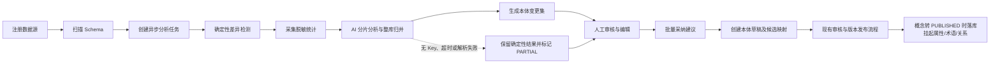

# 数据源扫描后的 AI 本体治理优化方案

> 文档状态：已实现（Python 后端与共用前端）
> 适用范围：`bemodel-server-py` Python 后端与 `bemodel-web` 前端；Java 后端不新增对应能力。
> 修订：2026-09-28 —— 依据代码评审明确元素生效语义（属性/术语/关系延迟落库）、外键与漂移采集、候选映射共存、任务重试与取消规则。

## 1. 背景与目标

新业务数据库接入 BeModel 后，平台需要回答两个不同层次的问题：

1. 物理表和字段能否映射到已有本体；
2. 现有本体是否缺少概念、属性、术语、关系、规则、动作或指标。

本方案在现有 Schema 扫描与字段映射能力之上增加整库级 AI 本体治理分析。系统自动发现语义覆盖缺口并形成可审计的变更建议，但不允许 AI 直接修改或发布正式本体。

目标如下：

- 扫描完成后自动、异步分析整个数据源，避免阻塞扫描请求；
- 先做确定性差异检测，再由 AI 补充语义判断；
- 默认只使用 Schema 和脱敏统计，不向模型发送患者明细；
- 所有建议均需人工审核，并通过现有本体生命周期发布；
- 支持失败恢复、结果追溯、重复分析去重和整批回滚。

## 2. 现状与问题

当前数据源接入链路为：注册数据源、测试连接、扫描表结构、选择单表、请求 AI 映射推荐、人工采纳映射。

现有能力存在以下边界：

- AI 分析以单表为单位，只在已有且已发布的概念和属性中推荐映射；
- 未匹配字段只会登记到 `bm_ontology_miss` 缺口池，不能形成完整的本体变更方案；
- 系统不会从整库视角识别新的业务实体、表间关系、状态机和业务约束；
- 缺少分析任务、证据快照、审核、批量采纳和失败恢复机制；
- 概念、规则和动作有 `DRAFT` 生命周期，但属性、关系、术语和映射没有草稿状态；且线上消费端不统一按概念状态过滤：问数语义上下文读取全部关系，拒答护栏匹配全部属性名，术语在问数归一、检索和临床规则引擎中均无过滤读取，提前写入会立即影响线上语义查询；
- Schema 扫描只读取表、列与主键标记，不采集外键约束；重扫采用“全删重建”，旧快照随即丢失，表列漂移与孤儿映射目前无从获得；
- 仅凭表名、字段名和注释无法可靠推断业务规则与动作，直接生成可执行规则存在医疗语义风险。

因此，新能力应定位为“AI 辅助治理与变更建议”，而不是“AI 自动建模”。

## 3. 总体原则

1. **AI 只建议，人工做决定**：置信度只用于排序，任何建议都不能自动发布。
2. **确定性分析优先**：先匹配已有本体、键约束、枚举和值域，再调用模型处理语义歧义。
3. **正式模型延迟生效**：审核过程全部发生在独立变更集中，发布前不得影响线上本体和问数白名单；变更集发布只写草稿态元素、未确认映射，以及经人工审核明示立即生效的少量元素（见 7.3），新概念的属性、术语、关系和指标一律延迟落库。
4. **最小数据暴露**：默认只发送结构和脱敏统计，不发送明细行或敏感字段样值。
5. **证据可追溯**：每条建议必须指向来源表列、确定性证据、模型理由和所依据的本体版本。
6. **整批一致性**：发布变更集时校验依赖并使用单个平台库事务写入本次应落库的元素，失败全部回滚；挂起元素不随该事务写正式表（见 7.3）。
7. **保守生成规则**：规则、动作和指标只有在证据充分时才形成待补全草稿，不生成或执行任意 SQL。

## 4. 目标流程

扫描事务提交后才创建分析任务，外部模型调用不得占用 Schema 扫描事务。扫描接口立即返回，前端通过任务查询接口展示进度和结果。变更集发布只落草稿态与未确认元素；新概念的属性、术语和关系作为挂起载荷随概念发布落库，详见 7.3。

## 5. 异步分析与证据采集

### 5.1 持久化任务

分析任务状态定义为：

- `PENDING`：等待执行；
- `RUNNING`：正在分析；
- `SUCCEEDED`：确定性与 AI 分析均成功；
- `PARTIAL`：确定性结果可用，但 AI 不可用或部分分片失败；
- `FAILED`：没有可用结果；
- `CANCELLED`：被管理员取消。

任务记录数据源编码、扫描指纹、分析所依据的本体版本与本体摘要、模型、进度、错误摘要、创建人与时间。使用现有后台调度器轮询任务，通过数据库条件更新抢占任务，避免多个服务实例重复执行。服务重启后将超时的 `RUNNING` 任务安全回收为可重试状态。

相同数据源、扫描指纹和本体基线（Release 标签与本体摘要）只允许存在一个有效分析任务。Schema 未变化时复用已有结果；管理员可以显式要求重新分析。

### 5.2 扫描指纹

扫描指纹由规范化后的表名、表注释、字段名、字段类型、字段注释、主键和外键约束计算。字段顺序固定后再哈希，避免数据库返回顺序导致误判。当前扫描实现只读取表、列与主键标记，需要扩展扫描 SQL 从 `information_schema.KEY_COLUMN_USAGE` 采集外键并落库到新的快照表（见 8.4），指纹计算随之纳入外键。

扫描在同一事务内先对比新旧快照产出表列漂移清单（新增/删除/类型与注释变化的表和列）并持久化（见 8.5），再执行“全删重建”，避免重扫销毁历史后无从比较。已确认映射指向被删除列时形成孤儿映射，由确定性阶段登记为 `CONFLICT` 清理建议，不自动删除。

“本体版本”定义为最近一次 Release 的版本标签（无 Release 时记为 `未发布`）。Release 标签只在发布时变化，无法感知草稿级编辑，因此任务和变更集同时记录“本体摘要”：对已发布与草稿的概念、属性、关系、术语、规则、动作和指标的关键字段做规范化哈希。审核期间若扫描指纹、Release 标签或本体摘要任一变化，变更集标记为 `STALE`，必须重新分析或执行显式重新校验后才能发布。

### 5.3 脱敏统计

默认允许采集以下白名单统计：

- 表行数估计；
- 字段空值率、去重数；
- 数值字段的最小值和最大值；
- 低基数字段的有限枚举值及频数。

不读取或发送明细行。字段名、注释或类型命中姓名、证件号、电话、地址、病历文本等敏感规则时，不采集样值，只保留类型和基数等不可逆统计。

统计查询必须满足以下限制：

- 表名和字段名只能来自扫描快照并进行 MySQL 标识符转义；
- 只允许系统生成的聚合查询，不接受模型生成 SQL；
- 设置单查询超时、单表字段上限、枚举基数上限和任务总预算；
- 查询失败只降低对应证据完整度，不阻断其他表的分析；
- 统计采集范围、耗时和失败原因进入审计日志。

## 6. 分级建议模型

### 6.1 确定性阶段

模型调用前完成以下分析：

- 已有映射、同名编码、中文名称和术语匹配；
- 字段类型与本体属性类型兼容性；
- 主键、外键和命名模式形成的候选实体关系；医疗 HIS 库普遍缺少物理外键，外键缺失时以命名模式、关联键类型和基数为主要证据，并在证据中标注降级；
- 低基数字段形成的候选值映射；
- 本次扫描与上次扫描之间的表列漂移；
- 与现有概念、关系、规则或映射的明确冲突。

确定性结果作为 AI 输入和最终证据的一部分，避免模型重复创建已有元素。

确定性阶段同时接管缺口登记：数据源存在非终态变更集（`DRAFT/REVIEWED/ADOPTED`）期间，单表映射推荐不再向 `bm_ontology_miss` 登记该数据源的新缺口，避免两套发现机制重复；变更集中被 `REJECTED` 的建议不回流缺口池；变更集关闭（发布或全部拒绝）后恢复原有登记行为。

### 6.2 AI 分析

为控制上下文长度，按表分片分析，再执行整库归并。模型输出必须通过严格 JSON Schema 校验；引用不存在的表列、非法编码、未知元素类型、重复项或不合法依赖时，转为不可采纳告警。

新增调用类型 `DATASOURCE_ONTOLOGY_ANALYSIS`，纳入现有 LLM 审计。该调用使用温度 `0`。无 API Key、请求超时或解析失败时，保留确定性结果并将任务标记为 `PARTIAL`。

### 6.3 建议分类

每条建议包含元素类型、操作类型、建议载荷、来源表列、证据、置信度、风险等级、依赖项、判断理由、缺失信息和审核状态。

操作类型包括：

- `REUSE_EXISTING`：复用已有概念或属性并建立候选映射；
- `CREATE`：新建概念、属性、术语、关系、规则、动作或指标；
- `EXTEND`：扩充现有概念；因属性、术语和值映射没有草稿状态且消费端不过滤，首期不自动写入正式表，只生成人工执行待办（见 7.3）；
- `CONFLICT`：与现有定义、类型、关系或值域冲突；
- `INSUFFICIENT_EVIDENCE`：证据不足，只给出治理提示。

### 6.4 全要素分级策略

| 元素 | 首期处理方式 | 主要证据 |
| --- | --- | --- |
| 概念 | 可采纳建议 | 表语义、主键、表注释、与已有概念相似度 |
| 属性 | 可采纳建议 | 字段名、类型、注释、空值率、基数 |
| 术语 | 可采纳建议 | 产品名称、表列别名、标准编码特征 |
| 关系 | 可采纳建议 | 外键、关联键、跨表命名和基数 |
| 值映射 | 可采纳建议 | 低基数统计、字段注释中的码值说明 |
| 规则 | 证据充分时生成待补全草稿 | 明确约束、值域、跨表一致性证据 |
| 动作 | 证据充分时生成待补全草稿 | 明确状态字段及可验证状态迁移 |
| 指标 | 证据充分时生成待补全草稿 | 明确业务口径、聚合维度和负责人信息 |

规则、动作和指标不得仅凭字段名称形成可执行内容。缺少业务定义、负责人、严重度、引擎或状态迁移证据时，必须标记待补充或 `INSUFFICIENT_EVIDENCE`。

各元素的落库时机（变更集发布即写、跟随概念发布挂起、人工执行）统一见 7.3 节生效语义表。

## 7. 变更集审核与发布

### 7.1 独立变更集

由于属性、关系和映射没有现成的草稿生命周期，所有 AI 建议先保存在独立“本体变更集”，不得在分析或采纳阶段直接写正式表。

管理员可按数据表、元素类型、风险、置信度和状态筛选建议，并执行：

- 编辑建议编码、名称、领域、定义、关系和值域；
- 接受、拒绝或标记待补充；
- 查看来源表列、统计证据、AI 理由和依赖项；
- 批量联选依赖项并处理冲突。

“批量采纳”只改变变更集中的审核状态，不影响线上语义模型。

### 7.2 发布变更集

发布前校验数据源仍为有效状态、扫描指纹未变化、Release 标签与本体摘要均未变化、编码唯一、引用完整且所有必填信息齐全，并对发布后立即生效的元素（两端概念均已发布的关系、已发布概念的新增术语）执行本体自检阻断项检查。

发布使用一个平台库事务，只写入本次应当落库的元素，按以下顺序：

1. 领域与 `DRAFT` 概念（消费端按 `PUBLISHED` 过滤，落库即惰性）；
2. `DRAFT` 规则与动作（同上，惰性）；
3. 两端概念均已发布的关系、已发布概念的新增术语（经人工审核，发布即生效）；
4. 候选映射；
5. 挂起元素登记：新概念的属性、术语、关系和值映射载荷标记为 `PENDING_RELEASE`，随概念发布落库（见 7.3），不在本事务写正式表。

落库规则：

- 新概念、规则和动作写为 `DRAFT`，不得自动进入 `REVIEW` 或 `PUBLISHED`；
- 新概念的属性、术语、关系不随本事务写入 `bm_attribute/bm_term/bm_relation`：这些表没有生命周期列，线上消费端（问数语义上下文、拒答护栏、术语归一、检索、临床规则引擎）也不按概念状态过滤，提前写入会立即改变线上行为；
- 候选映射维持一列一映射语义：目标列无映射时插入 `confirmed=0`、`source=AI_GOVERNANCE`；已有未确认候选映射时按唯一键替换并保留变更集审计；目标列已有 `confirmed=1` 映射时不写入，该建议转 `CONFLICT`，待人工显式解除或替换旧映射；人工确认候选映射即更新该行 `confirmed=1` 进入问数白名单；
- 对现有已发布概念的属性、术语和值映射扩充（`EXTEND`）不在本事务落库，转为人工执行待办；
- 任一唯一性、依赖、并发版本或持久化校验失败时整批回滚。

完成草稿创建后，概念、规则和动作继续使用现有审核与版本发布流程。变更集保留生成快照、编辑记录、采纳人、发布时间和最终生成元素 ID，供审计和回溯。

### 7.3 元素生效语义与挂起元素落库

属性、关系、术语和指标既没有草稿生命周期，线上消费端也不按所属概念状态过滤，且 Java 后端共享同一平台库、无法为其补充过滤逻辑，因此不采用“变更集发布时提前写正式表”的方式，按元素类型划分生效时机：

| 元素 | 落库时机 | 说明 |
| --- | --- | --- |
| 领域 | 变更集发布即写 | 低风险分类信息，不进入问数语义上下文 |
| 概念、规则、动作 | 变更集发布即写 `DRAFT` | 消费端已按 `PUBLISHED` 过滤，天然惰性 |
| 候选映射（含值映射载荷） | 变更集发布即写 `confirmed=0` | 问数白名单只读 `confirmed=1` |
| 两端概念均已发布的关系 | 变更集发布即写 | 经人工审核，明示立即生效，预检跑本体自检 |
| 已发布概念的新增术语 | 变更集发布即写 | 经人工审核，明示立即生效 |
| 新概念的属性、术语、关系 | 挂起，概念转 `PUBLISHED` 时同事务写入 | 载荷保存在变更项 `payload_json` 并登记 `PENDING_RELEASE` |
| `EXTEND`（已发布概念的属性、术语、值映射修订） | 人工执行 | 变更集生成待办，人工在现有建模界面完成后回填 `result_ref_json` |
| 指标 | 人工执行 | `bm_metric` 无生命周期列且被指标监控即时消费，待补全草稿经人工完成后落库 |

挂起元素落库机制：

- 概念在现有流程中转换为 `PUBLISHED` 时，平台在同一事务中写入该概念名下全部 `PENDING_RELEASE` 的属性、术语和关系；关系要求两端概念均为 `PUBLISHED`，另一端尚未发布的关系保持挂起；
- 概念草稿审核期间，变更集工作台通过变更项载荷展示挂起元素全貌，审核者无需等落库即可看到完整提案；
- 调度器定期对账兜底：发现挂起元素的依赖概念均已 `PUBLISHED` 但元素未落库（如概念经 Java 端发布、钩子未触发）时幂等补齐；
- 挂起元素落库失败不影响概念发布本身，进入对账重试；变更集记录挂起元素落库状态，全部落库后变更集才算彻底完成。

## 8. 数据模型设计

使用新的增量迁移创建独立表，不修改既有 V1–V30 迁移。

### 8.1 `bm_ontology_analysis_task`

保存异步任务，核心字段包括：

- `id`、`ds_code`、`status`、`progress`、`phase`（`DETERMINISTIC/STATS/AI/MERGE/DONE`）；
- `scan_fingerprint`、`ontology_version`（Release 标签）、`ontology_digest`（全量元素规范化摘要哈希）；
- `model`、`attempt_count`、`locked_at`、`worker_id`；
- `error_message`、`created_by`、`created_at`、`started_at`、`finished_at`。

对数据源、状态和创建时间建立索引，并通过唯一约束或服务层幂等键防止相同基线重复创建有效任务。

### 8.2 `bm_ontology_change_set`

保存一次整库分析的审核单元，核心字段包括：

- `id`、`task_id`、`ds_code`、`name`；
- `status`：`DRAFT/REVIEWED/ADOPTED/PUBLISHED/STALE/FAILED`；
- `scan_fingerprint`、`ontology_version`、`ontology_digest`；
- 建议数量、风险摘要、创建人、审核人及时间戳。

### 8.3 `bm_ontology_change_item`

保存单条建议，核心字段包括：

- `id`、`change_set_id`、`item_type`、`operation`；
- `review_status`：`PENDING/ACCEPTED/REJECTED/NEEDS_INPUT`；
- `target_key`、`payload_json`、`evidence_json`、`dependency_json`；
- `confidence`、`risk_level`、`reason`、`missing_information`；
- `source_table`、`source_column`、`result_ref_json`（含挂起元素落库状态 `PENDING_RELEASE/RELEASED`）；
- 创建、编辑、审核相关时间与用户字段。

JSON 字段保存结构化载荷，但数据源、状态、元素类型、审核状态和目标键使用独立列建立索引，避免所有查询依赖 JSON 扫描。

### 8.4 `bm_physical_fk`

外键约束快照，扩展扫描时从 `information_schema.KEY_COLUMN_USAGE` 采集：

- `id`、`ds_code`、`constraint_name`；
- `table_name`、`column_name`、`ref_table_name`、`ref_column_name`；
- 对 `ds_code + table_name + column_name` 建索引，随扫描“全删重建”。

### 8.5 `bm_schema_drift`

扫描事务内新旧快照对比产出的漂移清单：

- `id`、`ds_code`、`drift_type`（`TABLE_ADD/TABLE_DROP/COLUMN_ADD/COLUMN_DROP/COLUMN_CHANGE`）；
- `table_name`、`column_name`、`detail_json`（前后值对比）；
- `detected_at`、`scan_fingerprint`；
- 对 `ds_code` 和 `scan_fingerprint` 建索引，分析任务按指纹消费，仅保留最近若干次指纹的漂移记录。

## 9. API 设计

所有接口继续遵守 `{code: 0, msg: "ok", data: ...}` 响应契约。

### 9.1 扫描与任务

- 扩展 `POST /api/datasource/scan/{dsCode}`：保留 `dsCode`、`tableCount`，新增 `scanFingerprint`、`analysisTaskId`、`analysisStatus`，旧前端可忽略新增字段。
- `POST /api/datasource/{dsCode}/ontology-analysis`：手动重试或强制重新分析；请求体 `scope` 取值 `AI_ONLY`（在原任务上重跑 AI 分片，`attempt_count+1`，仅替换仍为 `PENDING` 的 AI 建议项，已审核项保留）或 `FULL`（创建新任务和新变更集；旧变更集未发生任何审核操作则删除，否则标记 `STALE` 归档）。
- `POST /api/datasource/{dsCode}/ontology-analysis/cancel`：取消当前非终态任务，任务进入 `CANCELLED`，幂等。
- `GET /api/datasource/{dsCode}/ontology-analysis/latest`：查询最新任务、进度（`progress` 为 0-100 整数，`phase` 标识当前阶段）和结果摘要。

### 9.2 变更集

- `GET /api/ontology-change-set/{id}`：读取变更集、汇总和建议明细。
- `PATCH /api/ontology-change-set/{id}/items/{itemId}`：编辑建议或更新审核状态。
- `POST /api/ontology-change-set/{id}/adopt`：批量采纳指定建议及其依赖。
- `POST /api/ontology-change-set/{id}/publish`：重新校验并原子化创建草稿和候选映射。

写接口必须验证变更集当前状态并实现幂等；重复发布已成功的变更集返回已有发布结果，不重复创建元素。`FAILED` 仅用于发布预检或落库事务多次重试后仍失败的变更集，修复问题后可再次发布；分析任务失败（确定性结果都不可用）不创建变更集。

## 10. 权限与安全

- `ADMIN`、`EDITOR`：可重新分析、编辑、采纳和发布；
- `VIEWER`：只能查看任务、报告、证据和审核结果；
- 禁用或已删除的数据源不能创建新任务、采集统计或发布变更；
- 数据源账号继续建议使用只读权限；
- 密码、连接串、患者明细和敏感样值不得写入提示词、任务错误或 LLM 审计；
- AI 输出视为不可信输入，必须经过结构、引用、枚举和长度校验；
- 规则建议不得绕过现有 SQL 白名单、查询超时和结果上限。

## 11. 前端交互设计

在数据源绑定页面增加“治理分析”区域：

- 扫描完成后展示分析任务状态与进度，不阻塞用户继续浏览表结构；
- 展示概念覆盖率、字段映射覆盖率、冲突数和高风险建议数；
- 提供按表、元素类型、风险、置信度和审核状态筛选的变更集工作台；
- 建议详情同时展示“建议内容、来源证据、AI 理由、依赖与缺失信息”；
- 支持逐项编辑、接受、拒绝、批量采纳和发布前预检；
- `PARTIAL` 状态明确说明降级原因，并允许只审核确定性结果或原地重试 AI 阶段（保留已审核项）；
- `STALE` 状态禁止发布并引导重新分析；
- 变更集区分“已落库 / 挂起 / 人工待办”三类元素并分别展示状态；`EXTEND` 与指标类建议提供跳转现有建模界面的待办入口，人工完成后回填结果引用；
- 概念草稿详情通过变更集引用展示挂起的属性、术语和关系全貌，保证审核时看得到完整提案。

前端请求继续集中在 `bemodel-web/src/api/`，不另建请求客户端。

## 12. 测试与验收

### 12.1 单元测试

- 扫描指纹稳定性及 Schema 变化识别；
- 敏感字段识别、统计白名单、枚举和查询预算限制；
- 已有概念复用、类型兼容、外键关系和值映射检测；
- AI JSON Schema 校验、虚构表列拦截、重复建议归并；
- 规则和动作的证据门槛；
- 无 Key、超时、HTTP 错误和非法 JSON 降级；
- 外键快照采集与指纹纳入，无外键库的关系候选降级标注；
- 扫描漂移先对比后重建，孤儿映射登记 `CONFLICT`；
- 变更集发布后挂起载荷不出现在 `bm_attribute/bm_term/bm_relation`，问数语义上下文与拒答护栏不变。

### 12.2 任务与并发测试

- 扫描后自动入队且扫描请求立即返回；
- 多工作实例只能抢占一次；
- 相同基线幂等、强制重跑可用；
- 服务重启后恢复超时任务；
- 单表失败不丢失其他表结果，正确产生 `PARTIAL`。

### 12.3 事务与权限测试

- 变更集正常发布并创建预期草稿；
- 唯一键冲突、依赖缺失或中途异常时全部回滚；
- 重复发布不重复写入；
- 过期指纹或本体版本阻止发布；
- VIEWER 写操作返回 403，EDITOR/ADMIN 可审核发布；
- 禁用、删除的数据源不能启动分析；
- 概念转 `PUBLISHED` 时挂起元素同事务落库，另一端未发布的关系保持挂起，对账任务补齐经 Java 端发布的场景；
- 目标列已有 `confirmed=1` 映射时候选映射不写入并转 `CONFLICT`；
- 草稿级本体编辑触发本体摘要变化并使变更集 `STALE`；
- 存在非终态变更集时单表推荐不登记 miss，变更集关闭后恢复；
- 任务取消幂等，`AI_ONLY` 重试保留已审核建议项。

### 12.4 业务验收场景

1. 新库与现有本体高度重合，只建议复用和映射；
2. 新业务实体生成概念、属性和关系候选；
3. 低基数状态字段生成脱敏值映射和有证据的动作候选；
4. 注释缺失或高敏字段只输出低置信度或证据不足结果；
5. 模型返回非法编码、虚构表列、重复元素或可疑 SQL 时被拒绝；
6. 审核期间 Schema 或本体变化，变更集变为 `STALE`；
7. 发布失败不残留半套概念、关系或映射；
8. 变更集发布后概念仍处草稿时线上问数行为完全不变，概念转发布后挂起属性、术语、关系随之生效。

集成测试只连接隔离 MySQL。未调用真实 DeepSeek 时，验收报告必须明确只覆盖受控替身和无 Key 降级路径。

## 13. 默认假设与配置

- 扫描成功后默认自动创建异步分析任务；
- 默认只使用结构和脱敏统计，不读取或发送样本行；
- 默认所有 AI 建议必须人工审核，不提供“高置信自动发布”；
- 默认采用全要素分级建议，规则、动作和指标证据不足时只报告缺口；
- 默认候选映射为未确认状态，不进入正式问数白名单；
- 分片大小（默认 10 表/片）、单统计查询超时（默认 5 秒）、任务级统计总预算（默认 10 分钟）、任务超时（默认 30 分钟）、枚举基数上限（默认 200）、单表统计字段上限（默认 128）、AI 分片重试次数（默认 2 次）、任务轮询间隔（默认 30 秒）和挂起元素对账间隔（默认 5 分钟）通过 Python 配置项管理；
- 新增后端能力仅在 `bemodel-server-py` 实现，Java 后端保持冻结。

## 14. 分阶段落地建议

1. **任务与变更集基础设施**：迁移、实体、任务恢复、权限和审计；
2. **确定性分析与脱敏统计**：外键与漂移采集、扫描指纹、覆盖率、冲突和值映射候选；
3. **AI 分片分析**：结构化输出、全库归并、降级和安全校验；
4. **审核工作台与发布事务**：编辑、依赖联选、预检、批量落草稿与挂起元素登记（含概念发布钩子与对账）；
5. **专项验收与调优**：隔离库回归、真实数据规模压测、提示词和阈值优化。

每一阶段均应保持现有数据源扫描和单表映射推荐可用，避免新治理流程成为数据源接入的强制阻塞项。
